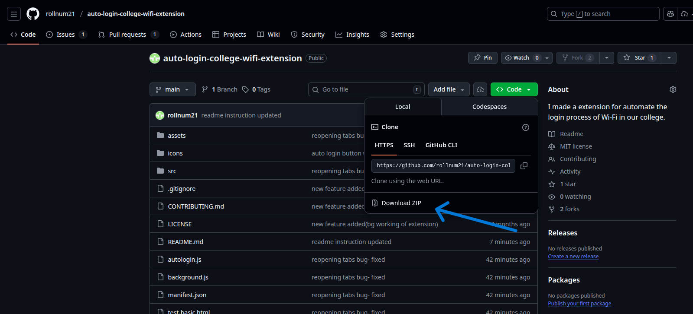
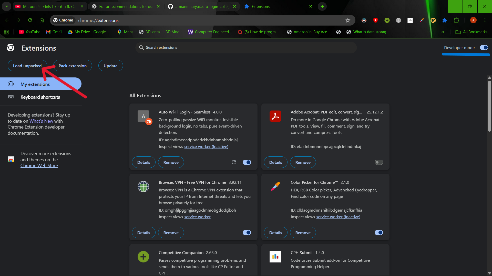
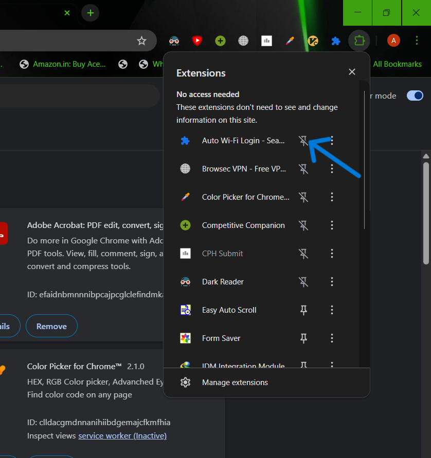

# Auto Login College Wi-Fi Extension

This Chrome extension automates the login process for your college Wi-Fi network, saving you time and hassle every time you connect.

## Features

- Automatically detects college Wi-Fi and logs in with your credentials
- Zero-polling passive monitoring (minimal CPU usage)
- Manual connect button for instant login
- Works silently in the background
- Simple setup and configuration

## Installation

1. **Download the extension**

   - Go to the GitHub repository: https://github.com/rollnum21/auto-login-college-wifi-extension
   - Click the green "Code" button
   - Select "Download ZIP"

   

2. **Extract the ZIP file**

   - Locate the downloaded ZIP file in your Downloads folder
   - Remember the location where you extracted the files

3. **Open Chrome Extensions page**

   - Open Google Chrome browser
   - Type `chrome://extensions/` in the address bar and press Enter
   - Or click the three dots menu (top right) > More tools > Extensions
   - Enable Developer mode (top right)

   

4. **Load the extension**

   - Click the "Load unpacked" button (appears after enabling Developer mode)
   - Navigate to the folder where you extracted the ZIP file
   - Select the `auto-login-college-wifi-extension` folder (the main folder containing manifest.json)
   - Click "Select Folder" or "Open"

5. **Verify installation**

   - The extension should now appear in your extensions list
   - You should see "Auto Login College Wi-Fi" with a green/blue icon

   

6. **Pin the extension**
   - Click the puzzle piece icon in the Chrome toolbar
   - Find "Auto Login College Wi-Fi" in the list
   - Click the pin icon next to it to pin the extension for easy access
   

## Configuration
1. **Open the extension popup**

   - Click the "Auto Login College Wi-Fi" icon in the Chrome toolbar
   - Fill the correct credentials and save.
   
## Usage

Once configured, the extension works automatically:

- Detects when you lose internet connection
- Automatically logs in to the Wi-Fi portal in the background
- Shows status updates via badge icon (ON/LOG/OFF/ERR)
- Use "Connect Now" button for instant manual login

No further action required. Enjoy seamless Wi-Fi connectivity without manual logins.

## Contributing

Contributions are welcome!

1. Fork the repository
2. Create your feature branch (`git checkout -b feature/AmazingFeature`)
3. Commit your changes (`git commit -m 'Add some feature'`)
4. Push to the branch (`git push origin feature/AmazingFeature`)
5. Open a Pull Request

Please make sure your code follows the existing style and includes relevant documentation.

## License

MIT
